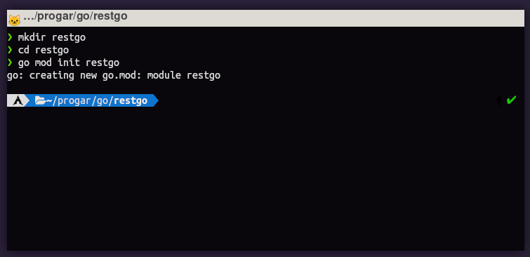
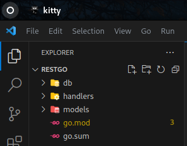
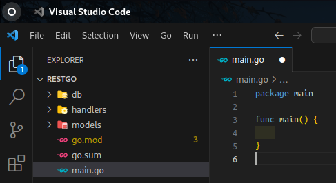
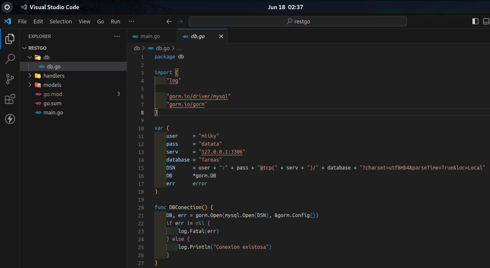
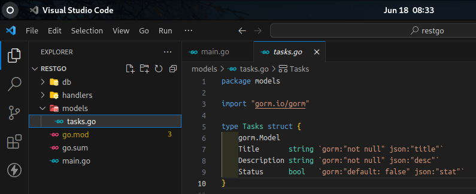
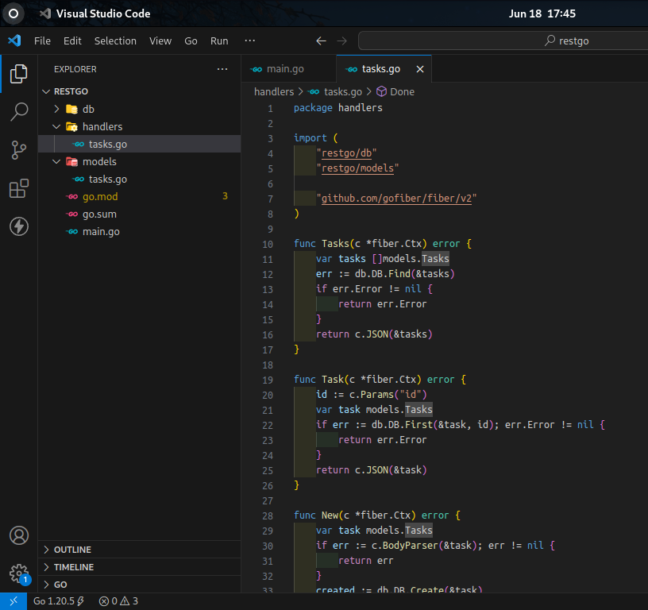
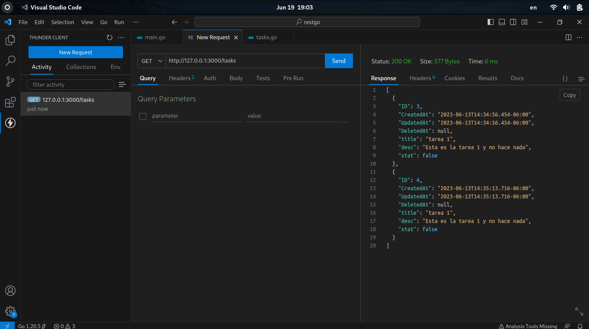

# Explicación rápida
El objetivo es crear una simple API REST con Go conectada una base de datos, se tratara de una API de lista de tareas exageradamente simple.
Para este proyecto utilizare las librerías de Go Fiber y un ORM llamado GORM, y como servidor de base de datos usare MySQL, pero puede ser usado cualquier otro.
## Que es fiber?
De acuerdo con la propia pagina de fiber: [gofiber.com](https://gofiber.io/)
Es un marco web inspirado en Express escrito en Go.
Fiber es un marco web Go creado sobre Fasthttp, el motor HTTP más rápido para Go. Está diseñado para facilitar las cosas para un desarrollo rápido teniendo en cuenta la asignación de memoria cero y el rendimiento.
## Que es un ORM?
Un Object Relational Mappings (ORM) es un modelo de programación que permite mapear las estructuras de una base de datos relacional (SQL Server, Oracle, MySQL, etc.), sobre una estructura lógica de entidades con el objeto de `simplificar y acelerar` el desarrollo de nuestras aplicaciones. [Deloite. - que es orm](https://www2.deloitte.com/es/es/pages/technology/articles/que-es-orm.html)
## Que es GORM?
GORM es una biblioteca ORM para el lenguaje de programación Go. ORM es un enfoque que permite a los desarrolladores mapear objetos en un lenguaje de programación orientado a objetos a tablas en una base de datos relacional. [Chat GPT](https://chat.openai.com).
# Creación del proyecto
En una carpeta vacía(y con go instalado)
```bash
go mod init <nombre del proyecto>
```
El comando `go mod init` se utiliza en Go para inicializar un módulo en un proyecto. Un módulo en Go es una unidad de código que se puede versionar, compartir y reutilizar de manera independiente.

# Dependencias
Go cuenta con su manejador de librerías similar a node.js con npm, y a php con composer.
Para instalar las dependencias podemos hacerlo con `go get`.
Opcionalmente se agrega la flag `-u` para actualizar la dependencia en caso de que ya exista en el proyecto
### Fiber.
```bash
go get -u github.com/gofiber/fiber/v2
```
### GORM
```bash
go get -u gorm.io/gorm
```
GORM necesita un driver para conectarse con tu base de datos, en este caso utilizare MySQL, pero si quieres utilizar otro motor de base de datos puedes consultar [GORM.io](https://gorm.io/docs/connecting_to_the_database.html)
```bash
go get -u gorm.io/driver/mysql
```
# Configuración y estructura del proyecto
Usando un editor de tu preferencia (en mi caso vscode) crearemos las carpetas y archivos necesarios (opcionales para cada proyecto, pero sugeridos para tener una buena estructura en el proyecto) como:
- `db` que sera usada para gestionar solamente la conexión a la base de datos.
- `handlers` que servirá para almacenar las operaciones de los métodos HTTP.
- `models` en el cual se almacenara el modelo de los objetos de la base de datos.

Y el archivo `main.go` en la raíz del proyecto.

Que en principio solo necesita contener esto:
```go
package main

func main() {
	
}
```
# Conexión a la base de datos

En la carpeta db creamos el archivo `db.go` en el cual se almacenara la información de la base de datos, el usuario, contraseña, host, nombre de la base de datos que se usara, la cadena de conexión necesaria y algunos objetos importantes para que `GORM` funcione.
Primeros se da nombre al paquete y se importan las librerias necesarias.
```go
package db

import (
	"log"

	"gorm.io/driver/mysql"
	"gorm.io/gorm"
)
```
Después la cadena de conexión necesaria para el driver la cual se llama Data Source Name (DSN), en este caso lo separo en diferentes cadenas para poder verlos mejor :)
También se declaran las variables necesarias para el funcionamiento de GORM.
```go
var (
	user     = "miiky"
	pass     = "datata"
	serv     = "127.0.0.1:3306"
	database = "Tareas"
	DSN      = user + ":" + pass + "@tcp(" + serv + ")/" + database + "?charset=utf8mb4&parseTime=True&loc=Local"
	DB       *gorm.DB
	err      error
)
```
En la funcion `DBConection` se verifica que la conexion sea exitosa y se notifica.
```go
func DBConection() {
	DB, err = gorm.Open(mysql.Open(DSN), &gorm.Config{})
	if err != nil {
		log.Fatal(err)
	} else {
		log.Println("Conexion existosa")
	}
}
```
# Modelo de datos

Ahora en la carpeta models, creamos el archivo `tasks.go` en el cual se almacenara el modelo de la tabla de tareas, este modelo servirá mas adelante para facilitar el acceso a la base de datos.
El parámetro gorm.Model, sirve para declarar elementos por defecto dentro de GORM, como puede ser el `ID`, `created_at`, `updated_at`, y ``deleted_at``.
Lo más destacable son los "comentarios" que se pueden encontrar al final del parámetro o componente, en estos se pueden declarar elementos específicos de la base de datos, como si es `not null`, o incluso su valor por defecto con `default: false` , esta información esta encapsulada de la declaración `gorm:""` como ejemplo: `gorm:"not null"`, horn se encargará de especificar los tipos de datos a la hora de migrar la base de datos.
Otra cosa destacable en esa misma posición es el `json:""` en el cual se puede especificar como se le reconocerá a estos parámetros al ser llamados mediante métodos con JSON. Todo esto dentro de estas comillas inclinadas ==\`\`==.
# Métodos
Ahora es momento de construir los métodos mediante los cuales se podrá acceder a la API, como lo pueden ser GET, POST, PUT, DELETE, o incluso PATCH. 
Estos métodos serán agregados en un archivo que llamare `tasks.go`, dentro de la carpeta `handlers`, estos no serán declarados de manera implícita como el método al que pertenecen, de esto se encargara el `main.go`.

Lo primero es nombrar el paquete e importar las dependencias.
```go
package handlers

import (
	"restgo/db"
	"restgo/models"

	"github.com/gofiber/fiber/v2"
)
```
Aquí ya se usan objetos que hemos creado en los paquetes anteriores, como lo son `db` y `models`.
## Obtener todas las tareas (GET)
```go
func Tasks(c *fiber.Ctx) error {
	var tasks []models.Tasks
	err := db.DB.Find(&tasks)
	if err.Error != nil {
		return err.Error
	}
	return c.JSON(&tasks)
}
```
El método recibe un contexto `c` de tipo `*fiber.Ctx`, que representa la solicitud y la respuesta HTTP. El objetivo principal de este método es recuperar una lista de tareas desde la base de datos y devolverla como respuesta JSON al cliente.

El código comienza declarando una variable `tasks` que es un slice (arreglo) de estructuras `models.Tasks`, que se supone que representa el modelo de datos de una tarea. Luego, se intenta buscar todas las tareas en la base de datos utilizando la función `db.DB.Find` proporcionada por GORM y se asigna el resultado a la variable err.

A continuación, se verifica si `err.Error` es diferente de `nil`. Si es diferente de nil, significa que ocurrió un error durante la consulta a la base de datos. En ese caso, se devuelve el error como respuesta HTTP.

Si no hubo errores, el método finaliza enviando una respuesta HTTP al cliente utilizando el método `JSON` del contexto `c`, que serializa el slice tasks en formato JSON y lo envía como respuesta al cliente.
## Obtener una sola tarea (GET)
```go
func Task(c *fiber.Ctx) error {
	id := c.Params("id")
	var task models.Tasks
	err := db.DB.First(&task, id)
	if err.Error != nil {
		return err.Error
	}
	return c.JSON(&task)
}
```
La función recibe un contexto c de tipo `*fiber.Ctx`, que representa la solicitud y la respuesta HTTP. El propósito de esta función es recuperar una tarea específica de la base de datos, identificada por un parámetro "id" proporcionado en la URL de la solicitud. A continuación, se devuelve la tarea como respuesta JSON al cliente.

En el código, se declara una variable `id` que se asigna al valor del parámetro "id" extraído del contexto `c`. Luego, se declara una variable task de tipo `models.Tasks`, que representa el modelo de datos de una tarea.

Se utiliza la función `First` proporcionada por GORM para buscar la primera tarea en la base de datos que coincida con el parámetro `id`. Si se produce un error durante la consulta a la base de datos, el error se devuelve como respuesta HTTP.

Si no se producen errores, se envía una respuesta HTTP al cliente utilizando el método `JSON` del contexto `c`. Este método serializa la tarea en formato JSON y la envía como respuesta al cliente.
## Crear una tarea (POST)
```go
func New(c *fiber.Ctx) error {
	var task models.Tasks
	if err := c.BodyParser(&task); err != nil {
		return err
	}
	created := db.DB.Create(&task)
	if created.Error != nil {
		return created.Error
	}
	return c.JSON(fiber.Map{
		"Status": "Registro exitoso",
	})
}
```
La función recibe un contexto c de tipo `*fiber.Ctx`, que representa la solicitud y la respuesta HTTP. El propósito de esta función es crear una nueva tarea en la base de datos utilizando los datos proporcionados en el cuerpo de la solicitud. A continuación, se devuelve un mensaje de éxito como respuesta JSON al cliente.

En el código, se declara una variable `task` de tipo `models.Tasks`, que representa el modelo de datos de una tarea. Luego, se utiliza el método `BodyParser` del contexto c para analizar el cuerpo de la solicitud y asignar los datos recibidos a la variable task. Si se produce un error durante el análisis del cuerpo de la solicitud, se devuelve el error como respuesta HTTP.

Si no se producen errores, se utiliza la función `Create` proporcionada por GORM para crear una nueva entrada de tarea en la base de datos utilizando la variable task. La función Create devuelve un objeto `created` que contiene información sobre el proceso de creación. Si se produce un error durante la creación de la tarea, el error se devuelve como respuesta HTTP.

Si no se producen errores durante la creación de la tarea, se envía una respuesta HTTP al cliente utilizando el método `JSON` del contexto `c`. Este método serializa un mapa (en este caso, `fiber.Map`) en formato JSON y lo envía como respuesta al cliente. El mapa contiene un campo "`Status`" con el valor "`Registro exitoso`", indicando que la creación de la tarea fue exitosa.
## Actualizar el status de una tarea (PATCH)
```go
func Done(c *fiber.Ctx) error {
	id := c.Params("id")
	var task models.Tasks
	if err := db.DB.First(&task, id); err.Error != nil {
		return err.Error
	}
	task.Status = !task.Status
	db.DB.Save(&task)
	return c.JSON(fiber.Map{
		"Status": "Se actualizo correctamente",
	})
}
```
La función recibe un contexto `c` de tipo `*fiber.Ctx`, que representa la solicitud y la respuesta HTTP. El propósito de esta función es marcar una tarea como completada o sin completar en la base de datos, según su estado actual. A continuación, se devuelve un mensaje de éxito como respuesta JSON al cliente.

En el código, se declara una variable `id` que se asigna al valor del parámetro "id" extraído del contexto c. Luego, se declara una variable task de tipo models.Tasks, que representa el modelo de datos de una tarea.

Se utiliza la función `First` proporcionada por GORM para buscar la primera tarea en la base de datos que coincida con el parámetro "id". Si se produce un error durante la consulta a la base de datos, el error se devuelve como respuesta HTTP.

Si no se produce ningún error, se modifica el campo Status de la tarea para invertir su estado actual. Esto se logra cambiando el valor de `task.Status` a su negación mediante el operador `!`.

A continuación, se utiliza la función `Save` proporcionada por GORM para guardar los cambios en la base de datos. La tarea modificada se pasa como argumento a Save.

Después de guardar los cambios, se envía una respuesta HTTP al cliente utilizando el método `JSON` del contexto `c`. Este método serializa un mapa (en este caso, `fiber.Map`) en formato JSON y lo envía como respuesta al cliente. El mapa contiene un campo "`Status`" con el valor "`Se actualizó correctamente`", indicando que la tarea se actualizó con éxito en la base de datos.
## Editar tarea (PUT)
```go
func Edit(c *fiber.Ctx) error {
	id := c.Params("id")
	var task models.Tasks
	if err := db.DB.First(&task, id); err.Error != nil {
		return err.Error
	}
	if err := c.BodyParser(&task); err != nil {
		return err
	}
	db.DB.Save(&task)
	return c.JSON(fiber.Map{
		"Status": "Se actualizo correctamente",
	})
}
```
La función recibe un contexto `c` de tipo `*fiber.Ctx`, que representa la solicitud y la respuesta HTTP. El propósito de esta función es editar una tarea existente en la base de datos utilizando los datos proporcionados en el cuerpo de la solicitud. A continuación, se devuelve un mensaje de éxito como respuesta JSON al cliente.

En el código, se declara una variable `id` que se asigna al valor del parámetro "id" extraído del contexto `c`. Luego, se declara una variable task de tipo `models.Tasks`, que representa el modelo de datos de una tarea.

Se utiliza la función `First` proporcionada por GORM para buscar la primera tarea en la base de datos que coincida con el parámetro "`id`". Si se produce un error durante la consulta a la base de datos, el error se devuelve como respuesta HTTP.

Si no se produce ningún error, se utiliza el método `BodyParser` del contexto `c` para analizar el cuerpo de la solicitud y asignar los datos recibidos a la variable task. Si se produce un error durante el análisis del cuerpo de la solicitud, el error se devuelve como respuesta HTTP.

Después de obtener los datos de la tarea del cuerpo de la solicitud y asignarlos a la variable `task`, se utiliza la función `Save` proporcionada por GORM para guardar los cambios en la base de datos. La tarea modificada se pasa como argumento a Save.

Una vez que se guardan los cambios, se envía una respuesta HTTP al cliente utilizando el método `JSON` del contexto `c`. Este método serializa un mapa (en este caso, `fiber.Map`) en formato JSON y lo envía como respuesta al cliente. El mapa contiene un campo "`Status`" con el valor "`Se actualizó correctamente`", indicando que la tarea se actualizó con éxito en la base de datos.
## Eliminar una tarea (DELETE)
```go
func Remove(c *fiber.Ctx) error {
	id := c.Params("id")
	var task models.Tasks
	if err := db.DB.First(&task, id); err.Error != nil {
		return err.Error
	}
	db.DB.Delete(&task)
	return c.JSON(fiber.Map{
		"Status": "Se elimino correctamente",
	})
}
```
La función recibe un contexto `c` de tipo `*fiber.Ctx`, que representa la solicitud y la respuesta HTTP. El propósito de esta función es eliminar una tarea existente de la base de datos, identificada por el parámetro "id" proporcionado en la URL de la solicitud. A continuación, se devuelve un mensaje de éxito como respuesta JSON al cliente.

En el código, se declara una variable `id` que se asigna al valor del parámetro "id" extraído del contexto c. Luego, se declara una variable `task` de tipo `models.Tasks`, que representa el modelo de datos de una tarea.

Se utiliza la función `First` proporcionada por GORM para buscar la primera tarea en la base de datos que coincida con el parámetro "`id`". Si se produce un error durante la consulta a la base de datos, el error se devuelve como respuesta HTTP.

Si no se produce ningún error, se utiliza la función `Delete` proporcionada por GORM para eliminar la tarea de la base de datos. La tarea a eliminar se pasa como argumento a Delete.

Una vez que se elimina la tarea, se envía una respuesta HTTP al cliente utilizando el método `JSON` del contexto `c`. Este método serializa un mapa (en este caso, `fiber.Map`) en formato JSON y lo envía como respuesta al cliente. El mapa contiene un campo "`Status`" con el valor "`Se eliminó correctamente`", indicando que la tarea se eliminó con éxito de la base de datos.
# main.go
```go
package main

import (
	"restgo/db"
	"restgo/handlers"
	"restgo/models"

	"github.com/gofiber/fiber/v2"
)

func main() {
	app := fiber.New()
	db.DBConection()
	db.DB.AutoMigrate(models.Tasks{})

	app.Get("/", handlers.Index)
	app.Get("/tasks", handlers.All)
	app.Post("/task", handlers.New)
	app.Get("/task/:id", handlers.Task)
	app.Patch("/task/:id", handlers.Done)
	app.Put("/task/:id", handlers.Edit)
	app.Delete("/task/:id", handlers.Remove)

	app.Listen(":3000")
}
```
1. Importaciones: Se importan los paquetes necesarios, incluyendo el paquete `fiber` para el framework Fiber, el paquete `cors` para el middleware de control de acceso HTTP y los paquetes locales `db`, `handlers` y `models` que contienen la configuración de la base de datos, los controladores y los modelos de datos respectivamente.
2. Función `main()`: La función principal del programa. Aquí se crea una instancia de la aplicación Fiber utilizando `fiber.New()` y se realiza la configuración inicial.
3. Configuración de la base de datos: Se llama a `db.DBConection()` para establecer la conexión con la base de datos. Luego, se utiliza `db.DB.AutoMigrate(models.Tasks{})` para migrar automáticamente el modelo de datos `Tasks` y crear las tablas correspondientes en la base de datos si aún no existen.
4. Definición de rutas: Se definen las rutas y se asocian a los controladores correspondientes. Por ejemplo, `app.Get("/tasks", handlers.Tasks)` establece la ruta "/tasks" y asocia el controlador `handlers.Tasks` para manejar las solicitudes GET a esa ruta.
5. Asignación de controladores: Se asignan los controladores de los diferentes métodos HTTP a las rutas específicas. Por ejemplo, `app.Post("/task", handlers.New)` asocia el controlador `handlers.New` para manejar las solicitudes POST a la ruta "/task".
6. Inicio del servidor: Finalmente, `app.Listen(":3000")` inicia el servidor en el puerto 3000.

# Ponerlo a funcionar
Regresamos a la terminal y con el comando 
```bash
go run .
```
pondremos a funcionar un servidor en el puerto 3000, tal como se describe anteriormente.
Y ahora ya podremos probarlo con cualquier cliente rest, en mi caso utilizare la extension de vscode ThunderClient

# Solucionar CORS
Cuando intentes acceder a la API desde cualquier otra aplicación web como lo puede ser react o incluso Apache con PHP o JavaScript, puede que te encuentres con un error que menciona la palabra CORS, pero que significa CORS?
## CORS
El intercambio de recursos de origen cruzado (CORS, por sus siglas en inglés), es un mecanismo basado en cabeceras HTTP que permite a un servidor indicar cualquier dominio, esquema o puerto con un origen (en-US) distinto del suyo desde el que un navegador debería permitir la carga de recursos. CORS también se basa en un mecanismo por el cual los navegadores realizan una solicitud de "verificación previa" al servidor que aloja el recurso de origen cruzado, con el fin de comprobar que el servidor permitirá la solicitud real. En esa comprobación previa, el navegador envía cabeceras que indican el método HTTP y las cabeceras que se utilizarán en la solicitud real.[mdn web docs](https://developer.mozilla.org/es/docs/Web/HTTP/CORS)
## Como solucionarlo?
En fiber es tan sencillo como agregar la librería de fiber dedicada a CORS, con:
```bash
go get -u github.com/gofiber/fiber/v2/middleware/cors
```
Y por ultimo al archivo main.go agregar la instruccion...
```go
	app.Use(cors.New(cors.ConfigDefault))
```
En este caso, `cors.New(cors.ConfigDefault)` crea una nueva instancia del middleware CORS con una **configuración predeterminada**. La configuración predeterminada permite solicitudes desde cualquier origen (`AllowOrigins: "*"`), acepta todos los métodos HTTP (`AllowMethods: "*"`), incluye todas las cabeceras en las solicitudes (`AllowHeaders: "*"`), permite el envío de cookies en las solicitudes (`AllowCredentials: true`), establece un tiempo de vida en caché de 12 horas (`MaxAge: 12 * time.Hour`), y permite que se incluyan los encabezados de respuesta personalizados (`ExposedHeaders: []string{}`).

```go
package main

import (
	"restgo/db"
	"restgo/handlers"
	"restgo/models"

	"github.com/gofiber/fiber/v2"
	"github.com/gofiber/fiber/v2/middleware/cors"
)

func main() {
	app := fiber.New()
	db.DBConection()
	db.DB.AutoMigrate(models.Tasks{})

	app.Use(cors.New(cors.ConfigDefault)) // agregar esta linea
	app.Get("/tasks", handlers.Tasks)
	app.Post("/task", handlers.New)
	app.Get("/task/:id", handlers.Task)
	app.Patch("/task/:id", handlers.Done)
	app.Put("/task/:id", handlers.Edit)
	app.Delete("/task/:id", handlers.Remove)

	app.Listen(":3000")
}
```
# Fin
Y listo ahora puedes consumir la API hecha en Go por los jajas en tus proyectos web. 
Si quieres aprender a consumirlo en react puedes consultar mi tutorial en el que uso React.
